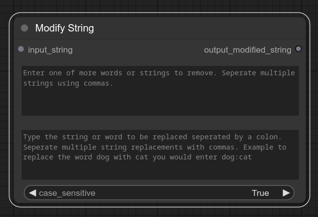
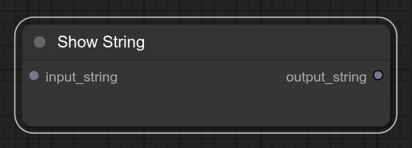
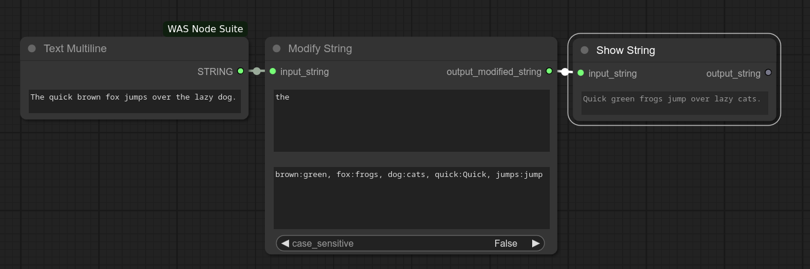

# ComfyUI_StringTools

## ModifyStringNode

A custom node for ComfyUI that provide functionality to modify strings based on specified rules such as removing substrings and replacing substrings with others. Supports removing and replacing single or multiple strings. Can be handy for removing or modifing words in prompts including outputs generated by LLMs.  

`Add Node > StringTools > Modify String`  



**Note:** You may need to drag and resize the `Modify String` node on first use to see all the text and options. 

## ShowStringNode

Simple node to display a string in the node itself. Like if you want to see the changes made by the above Modify String node your could link the `output_string` from ModifyStringNode to the the `input_string` or the Show String node.

`Add Node > StringTools > Show String`  




## Usage example


## Installation

```terminal
# Change to the directory you installed ComfyUI
cd pathTo/ComfyUI

# Change to the custom_nodes directory ie.
cd custom_nodes

# Clone the repo into custom_nodes
git clone https://github.com/bradsec/ComfyUI_StringTools.git

# Restart ComfyUI
```

